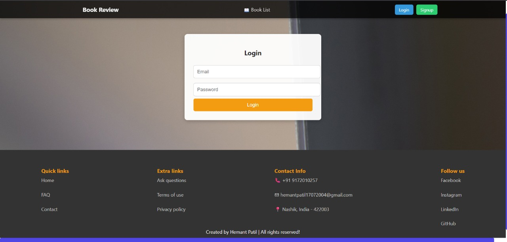
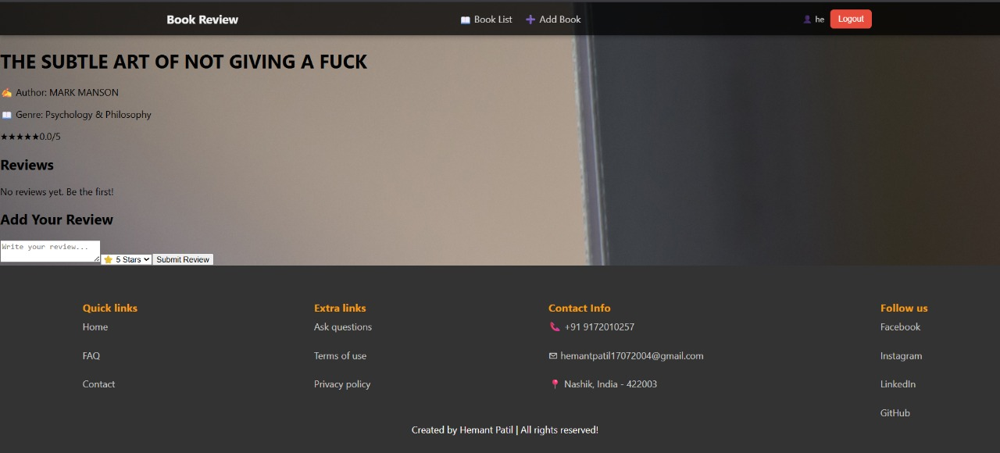

# 📚 Book Review Platform  

**Book Review Platform** is a **full-stack web application** where users can **sign up, log in, browse books, add reviews, and manage a watchlist.**  

Built with **React.js (frontend)** and **Flask (backend)**, it uses **JWT authentication, REST APIs, and a SQL database.**  
Interactive **SweetAlert2 popups** notify users of actions like **“Login Successfully”** or **“Book Added Successfully.”**  

---

## 🚀 Features  

✅ **User Authentication**  
- Sign up & login with JWT authentication  
- After login, a popup shows **"Login Successfully"**  
- Logout option with confirmation  

✅ **Book Browsing**  
- Search books by title, author, or genre  
- View detailed book info with cover image & description  

✅ **Book Reviews**  
- Add, edit, and delete reviews  
- Star rating system (1–5 stars)  
- Success popup: **"Book Added Successfully"**  

✅ **Watchlist**  
- Add books to your personal watchlist  
- Remove from watchlist anytime  

✅ **Notifications**  
- SweetAlert2 popups for success, errors, and confirmations  

✅ **Responsive UI**  
- Mobile-friendly design with a clean, modern look  

---

## 🛠 Tech Stack  

**Frontend**  
- React.js – UI framework  
- React Router – Navigation  
- Axios – API requests  
- TailwindCSS / Bootstrap – Styling  
- SweetAlert2 – Popups for success/error messages  

**Backend**  
- Python Flask – REST API backend  
- Flask-JWT-Extended – Authentication  
- SQLite / MySQL – Database  
- SQLAlchemy – ORM  

---


## 📂 Project Structure
Book-Review-Platform/
│
├── frontend/ # React Frontend
│ ├── public/
│ ├── src/
│ │ ├── components/ # Navbar, BookCard, Popup
│ │ ├── pages/ # Login, Signup, BookList, BookDetails
│ │ ├── services/ # API calls using Axios
│ │ └── App.js # Main React component
│ └── package.json
│
├── backend/ # Flask Backend
│ ├── app.py # Main Flask app
│ ├── models.py # Database models (User, Book, Review)
│ ├── routes/
│ │ ├── auth_routes.py # Login/Signup APIs
│ │ ├── book_routes.py # Book CRUD APIs
│ │ └── review_routes.py # Review APIs
│ ├── database.db # SQLite DB (or MySQL)
│ └── requirements.txt
│
├── README.md # Project documentation
└── .gitignore


---

## ⚡ Installation & Setup

### 1️⃣ Clone the repository
```bash
git clone https://github.com/yourusername/Book-Review-Platform.git
cd Book-Review-Platform


cd backend
python -m venv venv
source venv/bin/activate   # (Windows: venv\Scripts\activate)
pip install -r requirements.txt
flask run


cd frontend
npm install
npm start
🔐 Authentication Flow
User registers → POST /signup

User logs in → POST /login → returns JWT token

React stores token in localStorage

All future requests use Authorization: Bearer <token>

🎯 Functionalities & Popups
Login Successfully → After user logs in

Signup Successful → After new user creation

Book Added Successfully → After adding a new book

Review Submitted Successfully → After submitting a review

Book Deleted Successfully → After removing from watchlist


Swal.fire({
  title: 'Success!',
  text: 'Login Successfully',
  icon: 'success',
  confirmButtonText: 'OK'
});
🖼️ UI Preview
Login Page

Book List Page

Book Details + Reviews

Watchlist Page
# 📚 Book Review Platform  

A simple full-stack web app where users can **sign up, log in, browse books, add reviews, and manage a watchlist**.  
Built with **React.js (frontend)** and **Flask (backend)** using **JWT authentication, REST APIs, and SQL database**.  
Interactive popups notify users of actions like **“Login Successfully”** or **“Book Added Successfully.”**  

---

## 🖼️ Screenshots  

| Login Page | Dashboard | Book Details |
|------------|-----------|--------------|
|  |  |  |

| Add Review | Watchlist | Success Popup |
|------------|-----------|---------------|
|  |   |

*(Replace with your actual screenshot paths)*  

---

## 🚀 Features  
✅ User Authentication with JWT  
✅ Browse & Search Books  
✅ Add, Edit & Delete Reviews  
✅ Manage Watchlist  
✅ SweetAlert2 Popups for success/error  
✅ Responsive UI  

---

## 🛠 Tech Stack  
- **Frontend:** React.js, Axios, TailwindCSS/Bootstrap, SweetAlert2  
- **Backend:** Flask, Flask-JWT-Extended, SQLAlchemy  
- **Database:** SQLite / MySQL  

---  


📜 License
MIT License © 2025 Your Name

👨‍💻 Author
Hemant
 Computer Engineer | Passionate about Web & Cloud Technologies
